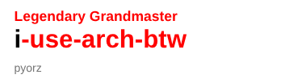

  

  <samp>
    <a href="https://phenomsg.github.io/">Portfolio</a> •
    <a href="https://github.com/PhenomSG">GitHub</a> •
    <a href="https://www.leetcode.com/phenomsg">LeetCode</a> •
    <a href="https://codeforces.com/profile/pyorz">Codeforces</a> •
    <a href="https://www.kaggle.com/phenomsg">Kaggle</a> •
    <a href="https://orcid.org/0009-0008-6994-0160">ORCID</a> •
    <a href="https://hub.docker.com/u/phenomsg">Docker</a> •
    <a href="https://drive.google.com/drive/folders/1mdV1wVu-px1EqNXy7Go2twFMuLg6FgSz?usp=sharing">Resume</a>
  </samp>

  
  

